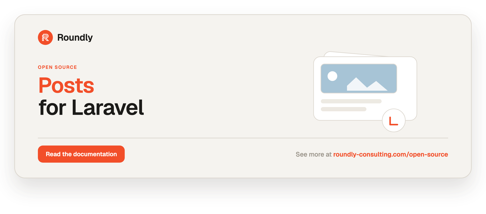

<!-- roundly-hero:start -->
<p align="center">
  <a href="https://roundly-consulting.com/open-source/docs/posts-for-laravel?utm_source=github&utm_medium=readme&utm_campaign=open-source&utm_content=posts-for-laravel">
    
  </a>
</p>
<!-- roundly-hero:end -->

# Posts for Laravel

A modern, multilingual, SEO-ready blog/posts engine for Laravel. Posts for Laravel gives you
translatable content, a real publishing lifecycle (draft / scheduled / published / archived),
a flexible taxonomy (nested categories + tags), per-post SEO meta and schema.org structured
data, and a polymorphic author that works with both bigint- and UUID-keyed models — all
config-first.

Built entirely on native Laravel: translatable attributes are stored as JSON columns and
resolved through a small package concern, with no third-party runtime dependencies.

## Requirements

- PHP 8.4+
- Laravel 12 or 13

## Installation

Install the package via Composer:

```bash
composer require roundly-consulting/posts-for-laravel
```

Publish and run the migrations (set your author key type first — see Configuration):

```bash
php artisan vendor:publish --tag="posts-migrations"
php artisan migrate
```

Optionally publish the config and views:

```bash
php artisan vendor:publish --tag="posts-config"
php artisan vendor:publish --tag="posts-views"
```

> **Author key type is fixed at first migrate.** The `author_id` column type is generated from
> `posts.author.key-type` when the migration runs. Choose `bigint` (default) or `uuid` to match
> your author model's primary key **before** running `migrate`. Changing it later requires a new
> additive migration.

> **PostgreSQL:** translatable columns ship as `json`. If you want indexed JSON queries, change
> them to `jsonb` in the published migration before migrating.

## Configuration

The published `config/posts.php`:

| Key | Type | Default | Env | Purpose |
|---|---|---|---|---|
| `model` | class-string | `Post::class` | — | The Post model (point at your subclass to extend). |
| `tables.posts` | string | `posts` | — | Posts table name. |
| `tables.categories` | string | `post_categories` | — | Categories table name. |
| `tables.category_post` | string | `category_post` | — | Category/post pivot table. |
| `tables.tags` | string | `post_tags` | — | Tags table name. |
| `tables.tag_post` | string | `post_tag` | — | Tag/post pivot table. |
| `author.key-type` | `bigint`\|`uuid` | `bigint` | `POSTS_AUTHOR_KEY_TYPE` | Author morph key column type. |
| `author.morph-name` | string | `author` | — | Morph relation name (`author_type`/`author_id`). |
| `author.nullable` | bool | `true` | — | Whether a post may have no author. |
| `locales.default` | string | `app.locale` | `POSTS_DEFAULT_LOCALE` | Default content locale. |
| `locales.fallback` | string | `app.fallback_locale` | `POSTS_FALLBACK_LOCALE` | Fallback locale for translations/route binding. |
| `locales.available` | list<string> | `['en']` | — | Locales iterated when generating slugs. |
| `slugs.source` | string | `title` | — | Attribute slugs are generated from. |
| `slugs.separator` | string | `-` | — | Slug word separator. |
| `slugs.unique` | bool | `true` | — | Suffix colliding slugs (`-2`, `-3`, …). |
| `slugs.route-binding` | bool | `true` | — | Bind `{post:slug}` by the translated slug. |
| `seo.site-name` | ?string | `null` | `POSTS_SITE_NAME` | Site name for SEO output. |
| `seo.twitter-site` | ?string | `null` | `POSTS_TWITTER_SITE` | Default `twitter:site` handle. |
| `seo.default-card` | string | `summary_large_image` | — | Default Twitter card type. |
| `seo.default-robots` | string | `index,follow` | — | Default robots directive. |
| `json-ld.type` | string | `BlogPosting` | — | schema.org `@type` (`BlogPosting` or `Article`). |
| `json-ld.author-attribute` | string | `name` | — | Author model attribute used for the author name. |
| `json-ld.publisher.name` | ?string | `null` | `POSTS_PUBLISHER_NAME` | Publisher organisation name. |
| `json-ld.publisher.logo` | ?string | `null` | `POSTS_PUBLISHER_LOGO` | Publisher logo URL. |
| `media.featured_bucket` | string | `featured` | — | Single-file featured-image bucket name. |
| `media.gallery_bucket` | string | `gallery` | — | Multi-file gallery bucket name. |
| `media.content_bucket` | string | `content` | — | Bucket owning media referenced inline by `[media:UUID]`. |
| `media.disk` | ?string | `null` | `POSTS_MEDIA_DISK` | Disk for post media (`null` = media-library default). |
| `media.featured_fallback_url` | ?string | `null` | `POSTS_MEDIA_FEATURED_FALLBACK` | URL `featuredImageUrl()` returns when no featured image is set. |
| `media.responsive_widths` | ?list<int> | `null` | — | Responsive width ladder (`null` = media-library default). |
| `media.seo_og_image` | bool | `true` | — | Fall back `og:image`/JSON-LD `image` to the featured image. |
| `media.og_variant` | string | `''` | — | Variant used for the og:image fallback (`''` = original). |
| `media.warm_on_publish` | bool | `true` | — | Queue variant generation for the post's media on publish. |
| `media.inline.enabled` | bool | `true` | — | Expand `[media:UUID]` tokens in rendered content. |
| `media.inline.default_variant` | string | `''` | — | Variant applied to inline tokens with no `\|variant`. |
| `media.inline.on_missing` | `strip`\|`keep` | `strip` | — | Drop or keep tokens whose media is missing/unauthorized. |

## Usage

### Authoring multilingual posts

Add the `HasPosts` trait to any author model (bigint or UUID keyed):

```php
use RoundlyConsulting\Posts\Concerns\HasPosts;

final class User extends Authenticatable
{
    use HasPosts; // $user->posts (morphMany)
}
```

Create a post with translated content. Each translatable attribute (`title`, `slug`, `perex`,
`content`, `meta_title`, `meta_description`) is stored as a JSON map of locale => value.
Slugs are generated per locale from the title, de-duplicated automatically, and a manually set
slug is preserved:

```php
use RoundlyConsulting\Posts\Models\Post;

$post = new Post;
$post->setTranslation('title', 'en', 'Hello world');
$post->setTranslation('title', 'sk', 'Ahoj svet');
$post->setTranslation('content', 'en', '<p>…</p>');
$post->save();

$post->author()->associate($user);   // polymorphic author
$post->save();

// Read a translation
$post->getTranslation('title', 'sk');     // 'Ahoj svet'
$post->getTranslations('title');          // ['en' => 'Hello world', 'sk' => 'Ahoj svet']
$post->translate('title');                // current-locale value, with fallback
$post->title;                             // same — current-locale value, with fallback
```

Translations resolve to the requested locale, then the fallback locale
(`translatable.fallback_locale`, else `posts.locales.fallback`, else `app.fallback_locale`),
then the first available translation.

### Publishing lifecycle

Posts move through a `PostStatus` enum (`Draft`, `Scheduled`, `Published`, `Archived`) with a
`published_at` timestamp. Transition methods fire events:

```php
$post->publish();                     // PostPublished
$post->schedule(now()->addDay());     // PostScheduled
$post->archive();                     // PostArchived
$post->draft();                       // PostDrafted
```

Query scopes:

```php
Post::query()->published()->get();    // status = published AND published_at <= now
Post::query()->draft()->get();
Post::query()->scheduled()->get();    // scheduled, or published with a future date
Post::query()->archived()->get();
```

Run the bundled command (or schedule it) to publish posts whose scheduled time has arrived:

```bash
php artisan posts:publish-scheduled
```

```php
// app/Console/Kernel.php
$schedule->command('posts:publish-scheduled')->everyMinute();
```

`PostStatus` (and the `PostsAuthorKeyType` config enum) build on
[`roundly-consulting/enums-for-laravel`](https://github.com/roundly-consulting/enums-for-laravel),
so every case ships readable labels, select options, lookups, and a ready-made validation rule
(see [Status labels & select options](#status-labels--select-options)).

### Categories and tags

```php
use RoundlyConsulting\Posts\Models\Category;

$guides = Category::create(['name' => ['en' => 'Guides']]);
$laravel = Category::create(['name' => ['en' => 'Laravel'], 'parent_id' => $guides->id]);

$post->categories()->sync([$guides->id, $laravel->id]);

// Tags: pass strings (find-or-created by translated name) or Tag models
$post->syncTags(['eloquent', 'php']);

// Filter
Post::query()->inCategory($laravel)->get();
Post::query()->inCategory('laravel')->get();   // by translated slug
Post::query()->withTag('php')->get();

// Category hierarchy helpers
$laravel->ancestors();    // [Guides]
$guides->descendants();   // [Laravel, …]
```

Category and tag `name` and `slug` are both translatable, and slugs are auto-generated from
the name.

### SEO meta and structured data

`meta_title` / `meta_description` are translatable; the remaining SEO fields live in a
non-translatable `seo` bag. Sensible fallbacks are applied (meta title → title, meta
description → perex):

```php
use RoundlyConsulting\Posts\DataTransferObjects\SeoData;

$post->setSeo(new SeoData(
    metaTitle: 'Custom title',
    canonical: 'https://example.test/posts/hello-world',
    ogImage: 'https://example.test/cover.png',
    robots: 'index,follow',
));
$post->save();

// In a Blade layout:
{!! $post->renderMetaTags() !!}   // <title>, description, canonical, og:*, twitter:*, robots
{!! $post->renderJsonLd() !!}     // <script type="application/ld+json"> BlogPosting/Article

$post->seo();        // SeoData with merged config defaults + fallbacks
$post->toJsonLd();   // array<string, mixed>
```

### Route-model binding by translated slug

With `posts.slugs.route-binding` enabled, `{post:slug}` resolves by the current locale's slug,
falling back to the configured fallback locale:

```php
Route::get('/posts/{post:slug}', fn (Post $post) => view('posts.show', compact('post')));
```

### Actions (DTO entry points)

```php
use RoundlyConsulting\Posts\Actions\CreatePostAction;
use RoundlyConsulting\Posts\DataTransferObjects\CreatePostData;
use RoundlyConsulting\Posts\DataTransferObjects\CreatePostTranslationData;
use RoundlyConsulting\Posts\Enums\PostStatus;

app(CreatePostAction::class)->execute(new CreatePostData(
    translations: [
        new CreatePostTranslationData(locale: 'en', title: 'Hello', content: '<p>…</p>'),
    ],
    status: PostStatus::Published,
    authorType: $user->getMorphClass(),
    authorId: $user->getKey(),
));
```

`PublishPostAction` and `UpdatePostSeoAction` are also available.

### Events

`PostPublished`, `PostScheduled`, `PostArchived`, `PostDrafted` (each carrying the `postId`)
are dispatched on the matching transition — listen for them to extend behaviour.

### Status labels & select options

Both package enums — `PostStatus` and the `PostsAuthorKeyType` config enum — use the
[`roundly-consulting/enums-for-laravel`](https://github.com/roundly-consulting/enums-for-laravel)
`Helpers` trait (pulled in automatically), so they expose a readable, select-, and validation-ready
surface with no hand-rolled helpers:

```php
use RoundlyConsulting\Posts\Enums\PostStatus;

PostStatus::Published->label();   // 'Published' (readable, translatable via __())
PostStatus::labels();             // ['Draft', 'Scheduled', 'Published', 'Archived']
PostStatus::values();             // ['draft', 'scheduled', 'published', 'archived']

PostStatus::toOptions();          // ['draft' => 'Draft', ...] for a <select>
PostStatus::options();            // Collection<EnumOption{ value, label, name }> for JS/Inertia

PostStatus::validationRule();     // 'in:draft,scheduled,published,archived'
PostStatus::fromName('Published'); // PostStatus::Published
```

Use it directly in validation so the allow-list never drifts as cases change:

```php
$request->validate([
    'status' => ['required', PostStatus::validationRule()],
]);
```

Labels pass through Laravel's `__()` helper (headlined from the case value), so you localise them
in your app's translation files. See the
[enums-for-laravel README](https://github.com/roundly-consulting/enums-for-laravel) for the full
trait surface (lookups, equality checks, fluent conditionals, random selection).

### Media (integrates with media-library)

Posts builds on
[`roundly-consulting/media-library-for-laravel`](https://github.com/roundly-consulting/media-library-for-laravel)
(pulled in automatically — its service provider auto-discovers). The bundled `Post` owns three
media buckets via the `HasPostMedia` concern: a single-file **featured** image, a multi-file
**gallery**, and a **content** bucket holding the media referenced inline by the post body.

```php
use Illuminate\Http\UploadedFile;

// Featured image (single-file — a new attach replaces the previous one)
$post->addMedia($request->file('cover'))->toMediaBucket($post->featuredBucket());
$post->featuredImage();          // ?Media
$post->featuredImageUrl();       // string ('' or the configured fallback when empty)

// Gallery (multi-file, order preserved)
$post->addMedia($file)->toMediaBucket($post->galleryBucket());
$post->galleryImages();          // Collection<int, Media>
$post->galleryImageUrls();       // list<string>
```

**Inline media in content.** Drop `[media:UUID]` (or `[media:UUID|variant]`) tokens into the post
body, attach those files to the post's content bucket, then render. Images become responsive
`` tags, other files become links; tokens resolve in a **single batched query** against the
post's **own** content media only (never an arbitrary global UUID), and a missing/unauthorized
token is silently stripped (or kept — see `posts.media.inline.on_missing`):

```php
$image = $post->addMedia($file)->toMediaBucket($post->contentBucket());
$post->setTranslation('content', 'en', "Intro [media:{$image->uuid}] outro")->save();

{!! $post->renderContent() !!}        // current locale
{!! $post->renderContent('sk') !!}    // a specific locale
```

**SEO fallback.** When a post has no explicit `og:image`, `seo()->ogImage` and the JSON-LD `image`
fall back to the featured image URL (toggle with `posts.media.seo_og_image`).

**Warm variants on publish.** Publishing a post dispatches a queued media `GenerateVariantsJob`
for its featured/gallery/content media so responsive derivatives are ready when it goes live
(toggle with `posts.media.warm_on_publish`).

## Migrating from the previous version (pre-release)

This unreleased version replaces the old `visible` boolean and single `content` column. For any
early adopter: `visible = true → status = published, published_at = now`;
`visible = false → status = draft`; move the old `content` into the `content` JSON translation
for your default locale. The `author-model` config is gone — authorship is now polymorphic.

## Testing

```bash
composer test
```

## Changelog

See [CHANGELOG.md](CHANGELOG.md).

## Contributing

Please see [CONTRIBUTING.md](CONTRIBUTING.md).

## License

The MIT License (MIT). See [LICENSE.md](LICENSE.md).
